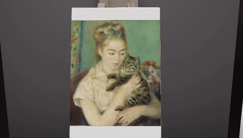

<p align="center">
  
</p>

A [SuchArt!](https://hypetraindigital.com/games/suchart-genius-artist-simulator) mod that adds support for importing images to use as references in your paintings.

<p align="center">
  
</p>

### Installing:
1. Install [MelonLoader](https://github.com/LavaGang/MelonLoader) on your game.
2. Paste the mod DLL into the SuchArt! mods folder `.../SuchArt/Mods/SuchOverlay.dll`.

If you use a linux you need to add [this](https://melonwiki.xyz/#/README?id=windows-games-wineproton) to the game initalization.

### Usage:
* Face close to the canvas you want to paint and press `P`, a pink overlay will appear in front of the canvas.
* After opening the game, a folder called `SuchOverlay` will appear inside the mods folder, add jpg or png images inside it. Press `i` to update the images.

### Controls:
* `P` Loads the overlay on the canvas.
* `i`  Reloads the image folder.
* `F1` Flip between Unlit and Lit shaders.
* `o`  Rotates the image by 90º.
* `,` `.`  Cycle between the images.
* `K` `L` `Numpad0` `Numpad1` Set the opacity to 0% and 100%.
* `ArrowKeys` Move the overlay.
* `Delete` `Keypad5` Reset the overlay (position, rotation and opacity).
* `PageUp` `PageDown` `Keypad7` `Keypad4` Changes the distance of the overlay from the canvas.
* `-` `=` `KeypadMinus` `KeypadPlus` Changes the opacity of the overlay. 

### Bugs:
* Doesn't work on the smallest `0.6:0.6`canvas, I'm not sure what is happening with the overlay when it parents into the canvas.

### Building:
Requires Mono to build.

1. Clone the project
2. Create a `libs` folder in the project root
3. In the game folder, copy these folders into the `libs` folder
```
SuchArt/MelonLoader
SuchArt/SuchArt_Data/Managed
```
4. Build Solution

#### Images used in the example: https://www.nga.gov/artworks/cats